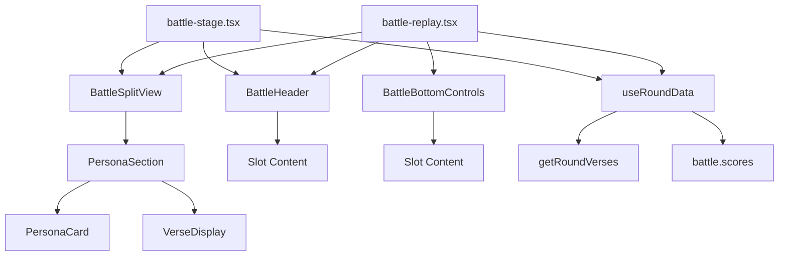

# Battle Components Architecture

## Component Hierarchy

### Before Refactor
```
battle-stage.tsx
├── <div> (header with sticky styles)
│   ├── Stage info (duplicated)
│   ├── BattleBell
│   ├── RoundTracker
│   └── Victory banner (conditional)
├── <div> (split screen wrapper)
│   ├── <div> (center divider)
│   └── <div> (2-col grid)
│       ├── Left side (duplicated structure)
│       │   ├── <div> (card wrapper)
│       │   │   └── PersonaCard
│       │   └── <div> (verse wrapper)
│       │       └── VerseDisplay
│       └── Right side (duplicated structure)
│           ├── <div> (card wrapper)
│           │   └── PersonaCard
│           └── <div> (verse wrapper)
│               └── VerseDisplay
├── Reveal scores button
└── ScoreDisplay (conditional)

battle-replay.tsx
├── <div> (header with sticky styles) ❌ DUPLICATE
│   ├── WinnerBanner
│   ├── CreatorAttribution
│   └── RoundControls
├── <div> (split screen wrapper) ❌ DUPLICATE
│   ├── <div> (center divider) ❌ DUPLICATE
│   └── <div> (2-col grid) ❌ DUPLICATE
│       ├── Left side ❌ DUPLICATE STRUCTURE
│       │   ├── <div> (card wrapper) ❌ DUPLICATE
│       │   │   └── PersonaCard
│       │   └── <div> (verse wrapper) ❌ DUPLICATE
│       │       └── VerseDisplay
│       └── Right side ❌ DUPLICATE STRUCTURE
│           ├── <div> (card wrapper) ❌ DUPLICATE
│           │   └── PersonaCard
│           └── <div> (verse wrapper) ❌ DUPLICATE
│               └── VerseDisplay
├── BattleDrawer (scores/song tabs)
└── <div> (bottom controls) ❌ DUPLICATE PATTERN
    ├── Scores button
    └── Song button
```

### After Refactor
```
battle-stage.tsx
├── BattleHeader ✅ SHARED
│   ├── Stage info
│   ├── BattleBell
│   ├── RoundTracker
│   └── Victory banner (conditional)
├── BattleSplitView ✅ SHARED
│   ├── PersonaSection (left) ✅ SHARED
│   │   ├── PersonaCard
│   │   └── VerseDisplay
│   └── PersonaSection (right) ✅ SHARED
│       ├── PersonaCard
│       └── VerseDisplay
├── Reveal scores button
└── ScoreDisplay (conditional)

battle-replay.tsx
├── BattleHeader ✅ SHARED
│   ├── WinnerBanner
│   ├── CreatorAttribution
│   └── RoundControls
├── BattleSplitView ✅ SHARED
│   ├── PersonaSection (left) ✅ SHARED
│   │   ├── PersonaCard
│   │   └── VerseDisplay
│   └── PersonaSection (right) ✅ SHARED
│       ├── PersonaCard
│       └── VerseDisplay
├── BattleDrawer (scores/song tabs)
└── BattleBottomControls ✅ SHARED
    ├── Scores button
    └── Song button
```

## Component Dependencies

### New Shared Components



## Data Flow

### useRoundData Hook

```
Input: (battle: Battle, round: number)
  │
  ├─> getRoundVerses(battle, round)
  │     │
  │     └─> { left: Verse | null, right: Verse | null }
  │
  ├─> battle.scores.find(s => s.round === round)
  │     │
  │     └─> RoundScore | undefined
  │
  └─> Compute derived state
        ├─> hasVerses: boolean
        ├─> hasBothVerses: boolean
        └─> isComplete: boolean

Output: RoundData {
  verses: { left, right },
  score: RoundScore | undefined,
  hasVerses: boolean,
  hasBothVerses: boolean,
  isComplete: boolean
}
```

### BattleSplitView Props Flow

```
battle-stage.tsx                    battle-replay.tsx
      │                                   │
      ├─ battle: Battle                   ├─ battle: Battle
      ├─ leftVerse: Verse | null          ├─ leftVerse: Verse | null
      ├─ rightVerse: Verse | null         ├─ rightVerse: Verse | null
      ├─ roundScore?: RoundScore          ├─ roundScore?: RoundScore
      ├─ showRoundWinner: boolean         ├─ showRoundWinner: boolean
      ├─ mobileActiveSide: Position       ├─ mobileActiveSide: null
      ├─ streamingPersonaId?: string      ├─ (no streaming)
      ├─ streamingText?: string           ├─ (no streaming)
      ├─ mobileTopOffset: number          └─ cardPadding: "p-6"
      └─ cardPadding: "p-3 md:p-4"
             │
             └──────────────────┬───────────────────┘
                                │
                                ▼
                        BattleSplitView
                                │
                    ┌───────────┴───────────┐
                    ▼                       ▼
              PersonaSection          PersonaSection
                 (left)                  (right)
                    │                       │
        ┌───────────┴──────────┐  ┌────────┴──────────┐
        ▼                      ▼  ▼                   ▼
   PersonaCard          VerseDisplay  PersonaCard  VerseDisplay
```

## Component Responsibility Matrix

| Component | Layout | State | Logic | Rendering |
|-----------|--------|-------|-------|-----------|
| **BattleHeader** | ✅ Header structure | ❌ | ❌ | ✅ Slot content |
| **BattleSplitView** | ✅ Split layout | ❌ | ✅ Visibility | ✅ PersonaSections |
| **PersonaSection** | ✅ Card+verse wrapper | ❌ | ❌ | ✅ Card+Display |
| **BattleBottomControls** | ✅ Fixed bottom bar | ❌ | ❌ | ✅ Slot content |
| **useRoundData** | ❌ | ❌ | ✅ Data fetching | ❌ |

## Interface Contracts

### BattleHeader
```typescript
interface BattleHeaderProps {
  sticky?: boolean;           // Position behavior
  className?: string;         // Custom styles
  children: React.ReactNode;  // Slot content
  variant?: "blur" | "solid" | "transparent"; // Background
}
```

### BattleSplitView
```typescript
interface BattleSplitViewProps {
  battle: Battle;                    // Full battle data
  leftVerse: Verse | null;          // Left verse content
  rightVerse: Verse | null;         // Right verse content
  roundScore?: RoundScore;          // Score data
  showRoundWinner?: boolean;        // Display winner badge
  mobileActiveSide?: Position | null; // Mobile visibility
  streamingPersonaId?: string | null; // Live streaming
  streamingText?: string | null;    // Streaming content
  mobileTopOffset?: number;         // Layout offset
  cardPadding?: string;             // Custom spacing
  className?: string;               // Container styles
  contentClassName?: string;        // Content wrapper styles
  style?: React.CSSProperties;      // Inline styles
}
```

### PersonaSection
```typescript
interface PersonaSectionProps {
  persona: Persona;          // Persona data
  verse: Verse | null;      // Verse content
  position: PersonaPosition; // "left" | "right"
  isActive?: boolean;       // Active indicator
  isRoundWinner?: boolean;  // Winner badge
  isStreaming?: boolean;    // Streaming state
  streamingText?: string;   // Streaming content
  mobileTopOffset?: number; // Layout offset
  visible?: boolean;        // Mobile visibility
  cardPadding?: string;     // Custom spacing
}
```

### useRoundData
```typescript
function useRoundData(
  battle: Battle,
  round: number
): RoundData

interface RoundData {
  verses: { left: Verse | null; right: Verse | null };
  score: RoundScore | undefined;
  isComplete: boolean;
  hasVerses: boolean;
  hasBothVerses: boolean;
}
```

## Composition Patterns

### Pattern 1: Header Composition
```tsx
// battle-stage uses BattleHeader with stage info
<BattleHeader>
  <Stage Info + BattleBell + RoundTracker />
</BattleHeader>

// battle-replay uses BattleHeader with winner banner
<BattleHeader>
  <WinnerBanner + CreatorAttribution + RoundControls />
</BattleHeader>
```

### Pattern 2: Split View Composition
```tsx
// Both components use BattleSplitView but with different configs
<BattleSplitView
  battle={battle}
  leftVerse={verses.left}
  rightVerse={verses.right}
  // Stage: Live streaming, mobile switching
  mobileActiveSide="left"
  streamingPersonaId={id}
  
  // Replay: Static, always show both
  mobileActiveSide={null}
  cardPadding="p-6"
/>
```

### Pattern 3: Data Hook Usage
```tsx
// Replaces manual data fetching
// Before:
const verses = getRoundVerses(battle, round);
const score = battle.scores.find(s => s.round === round);

// After:
const { verses, score, hasBothVerses } = useRoundData(battle, round);
```

## Reusability Map

```
┌─────────────────────────────────────────────────┐
│          Shared Component Library               │
├─────────────────────────────────────────────────┤
│                                                 │
│  BattleHeader ─────┬──> battle-stage.tsx       │
│                    └──> battle-replay.tsx       │
│                    └──> battle-preview.tsx  ⚡  │
│                                                 │
│  BattleSplitView ──┬──> battle-stage.tsx       │
│                    └──> battle-replay.tsx       │
│                    └──> battle-embed.tsx    ⚡  │
│                                                 │
│  PersonaSection ───┬──> (via BattleSplitView)  │
│                    └──> persona-compare.tsx ⚡  │
│                                                 │
│  useRoundData ─────┬──> battle-stage.tsx       │
│                    └──> battle-replay.tsx       │
│                    └──> round-stats.tsx     ⚡  │
│                                                 │
└─────────────────────────────────────────────────┘

Legend:
✅ Currently implemented
⚡ Potential future use
```

## File Organization

```
src/
├── components/
│   ├── battle/                    # ✨ NEW: Shared battle components
│   │   ├── index.ts              # Barrel export
│   │   ├── battle-header.tsx     # Header wrapper
│   │   ├── battle-split-view.tsx # Split layout
│   │   ├── persona-section.tsx   # Persona wrapper
│   │   └── battle-bottom-controls.tsx # Bottom bar
│   │
│   ├── battle-stage.tsx          # Live battle view (uses shared)
│   ├── battle-replay.tsx         # Replay view (uses shared)
│   │
│   ├── persona-card.tsx          # Leaf component
│   ├── verse-display.tsx         # Leaf component
│   ├── score-display.tsx         # Leaf component
│   └── ...
│
└── lib/
    ├── hooks/
    │   ├── use-round-data.ts     # ✨ NEW: Data fetching hook
    │   └── ...
    └── ...
```

## Benefits Visualization

### Maintenance: Single Point of Change

```
Before:
  Change split layout → Edit battle-stage.tsx → Edit battle-replay.tsx → Test both
  
After:
  Change split layout → Edit BattleSplitView.tsx → Test once → Benefits both automatically
```

### Scalability: Easy Feature Addition

```
Before:
  Add battle-preview → Copy 200 lines from existing files → Maintain 3 copies
  
After:
  Add battle-preview → Import <BattleSplitView /> → Done in 10 lines
```

### Testing: Isolated Component Testing

```
Before:
  Test split layout → Must test entire battle-stage + battle-replay (2 complex components)
  
After:
  Test split layout → Test BattleSplitView in isolation → Higher confidence
```

---

**Architecture Status: ✅ Production Ready**

This architecture provides:
- Clear separation of concerns
- Type-safe interfaces
- Composable components
- Easy maintainability
- High reusability
- Scalable structure


